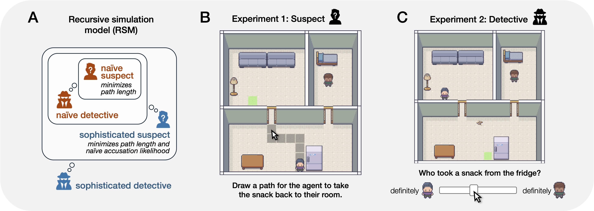

# Leave a trace: Recursive reasoning about deception

This repository contains materials for the paper "Leave a trace: Recursive reasoning about deception" by Verona Teo, Sarah A. Wu, Erik Brockbank, and Tobias Gerstenberg.

**Contents**:
- [Introduction](#introduction)
- [Experiments](#experiments)
- [Repository structure](#repository-structure)
- [CRediT author statement](#credit-author-statement)

## Introduction

How do people reason about others when planning deceptive actions? How do detectives infer what suspects did based on the traces their actions left behind? In this work, we explore deception in a setting where agents steal other's snacks and try to determine the most likely thief. We propose a computational model that combines inverse planning with recursive theory of mind to select misleading actions and reason over evidence arising from such plans. In Experiment 1, we demonstrate that suspects strategically modify their behavior when acting deceptively, aligning with our model's predictions. Experiment 2 reveals that detectives show increased uncertainty when evaluating potentially deceptive suspects—a finding consistent with our model, though alternative explanations exist. Our results suggest that people are adept at deceptive action planning, but struggle to reason about such plans, pointing to possible limits in recursive theory of mind.



## Experiments

Preregistrations for the experiments are available on the Open Science Framework (OSF) [here](https://osf.io/r4kqy).

The experiments can be previewed at the links below:
- [Suspect experiment](https://cicl-stanford.github.io/recursive_deception/exp1/)
- [Detective experiment](https://cicl-stanford.github.io/recursive_deception/exp2/)

## Repository structure 
```
├── code
│   ├── analysis
│   ├── simulation_model
│   └── trials
├── data
│   ├── exp1_suspect
│   └── exp2_detective
├── docs
│   ├── exp1_suspect
│   └── exp2_detective
└── figures
```
- `code`: contains code for model and analysis. 
	- `analysis`: code for analyzing data and generating figures, written in R (view a rendered file [here](https://cicl-stanford.github.io/recursive_deception/)).
	- `simulation_model`: code for the simulation model. 
	- `trials`: trial data used by the simulation model. 
- `data`: contains data for analyses.
	- `exp1_suspect`: data from anonymized participants, as well as outputs from GPT-4o and the simulation model. 
	- `exp2_detective`: data from anonymized participants, as well as outputs from GPT-4o, the simulation model, and the heuristic model. 
- `docs`: contains behavioral experiment code.
	- `exp1_suspect`: code for the suspect experiment. 
	- `exp2_detective`: code for the detective experiment. 
- `figures`: contains all figures from the paper (generated in `code/analysis`). 


## CRediT author statement 

[What is a CRediT author statement?](https://www.elsevier.com/researcher/author/policies-and-guidelines/credit-author-statement)

| Term                       | Verona | Sarah | Erik | Tobi |
|----------------------------|--------|-------|------|------|
| Conceptualization          | x      | x     | x    | x    |
| Methodology                | x      | x     | x    | x    |
| Software                   | x      | x     | x    |      |
| Validation                 | x      | x     |      | x    |
| Formal analysis            | x      | x     |      |      |
| Investigation              | x      |       |      |      |
| Resources                  | x      |       |      |      |
| Data Curation              | x      |       |      |      |
| Writing - Original Draft   | x      | x     | x    |      |
| Writing - Review & Editing | x      | x     | x    | x    |
| Visualization              | x      | x     |      |      |
| Supervision                | x      | x     | x    | x    |
| Project administration     | x      | x     | x    | x    |
| Funding acquisition        |        |       |      | x    |


## Citation

```
@inproceedings{teo2025deception,
  title = {Leave a trace: Recursive reasoning about deception},
  booktitle = {Proceedings of the 47th Annual Conference of the Cognitive Science Society},
  author = {Verona Teo and Sarah A. Wu and Erik Brockbank and Tobias Gerstenberg},
  year = {2025}
}
```
